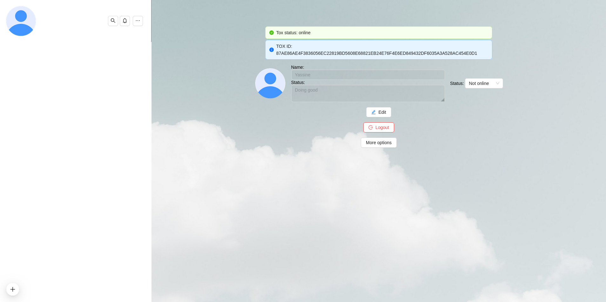
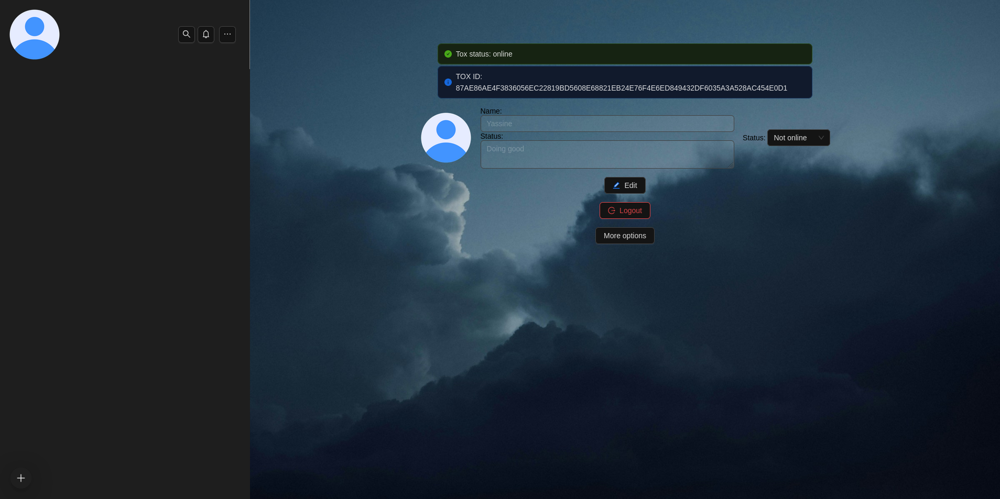
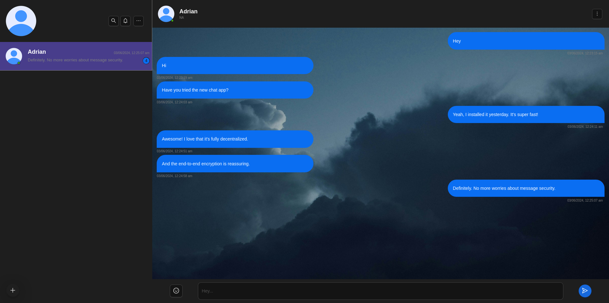
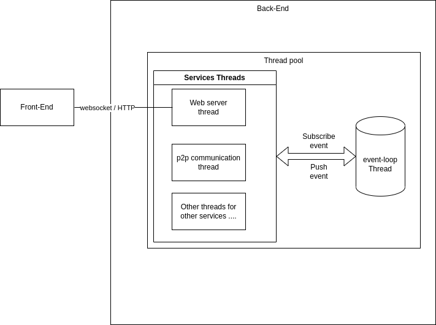

    <h2>Secure Chat</h2>
    
A peer-to-peer, decentralized, end-to-end encrypted chat application based on the TOX protocol

Table des matières

<ol>
    <li>À propos du projet</li>
    <li>Captures d'écran</li>
    <li>Architecture générale de l'application</li>
    <li>Organisation du code source</li>
    <li>Mesures de sécurité</li>
    <li>Compilation et exécution</li>
    <li>Exécution à l'intérieur de Docker</li>
    <li>Vidéo de démonstration</li>
</ol>

## À propos du projet
P2P SecureChat est une application de messagerie instantanée axée sur la confidentialité et la sécurité, conçue pour permettre des communications chiffrées entre utilisateurs via un réseau peer-to-peer décentralisé.

## Captures d'écran
### Front Page: (Light theme)

### Front Page: (Dark theme)

### Chatting with people

## Architecture générale de l'application

## Source Code organisation

## Security measures

## Compiling and Running

## Running it inside Docker

## Demo video

